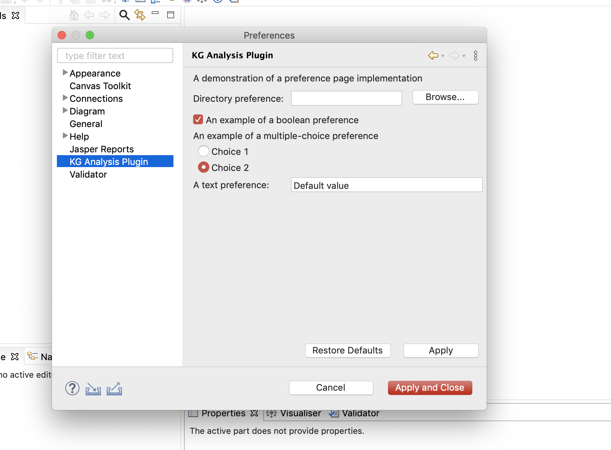

# archi-kganalysis-plugin

>[Archi](https://www.archimatetool.com/) plugin that uses Knowledge Graphs to detect Enterprise Architecture Smells.

## Archi Customizations

### Import/Export

<!-- TODO -->

### Preferences

### Menubar

<!-- TODO -->

---
 

## Notes

### Archi and ArchiMate

ArchiMate language comprises 5 **layers**:
- *Business* - business proccesses, functions, events, roles, services
- *Application* - components, interfaces, data objects
- *Technology* - artifacts, nodes, software, devices
- *Motivation* - business drivers, goals, requirementss
- *Implementation & Migration* - work package, deliverable, gap

Archi Concepts:

 

### EA Smells

[Knowledge Base for EA Smells](https://swc-public.pages.rwth-aachen.de/smells/ea-smells/)

 

### Eclipse RCP

Archi is developed based on the Eclipse Rich Client Platform (RCP).  

#### Plug-in manifest
Ties all the code and resources together. Split into 2 manifest files:
- `MANIFEST.MF`, contains OSGi configuration information (API and dependencies)
- `plugin.xml`, contains Eclipse specific extension mechanisms, *Extension-points* (interfaces  for plug-ins  to  contribute  functionality) and *Extensions* (functionality)

#### SWT and JFace

**Standard Widget Toolkit (SWT)** - Java based user interface library, provides lots of standard widgets, e.g., buttons and text field or custom widgets  
**JFace** - adds additional convenient functionality on top of SWT and makes the usage of SWT simpler (e.g., JFace builder API)

Key components of SWT:
- `Shell` - represents Window
- `Display` - manages event loops, fonts, colors (base for all SWT components)

[Available SWT widgets](https://www.eclipse.org/swt/widgets/)

### Links and Publications 

#### Links

[ArchiMate Language Specification](https://pubs.opengroup.org/architecture/archimate31-doc/toc.html)  
[Archi User Guide](https://www.archimatetool.com/downloads/Archi%20User%20Guide.pdf)  
[Archi GitHub Repo](https://github.com/archimatetool/archi) ([Wiki](https://github.com/archimatetool/archi/wiki))

**Archi Plugins**

[ArchiContribs](http://archi-contribs.github.io/)  
[Specialization Plugin](https://github.com/archi-contribs/specialization-plugin) - Icons and labels can be replaced in Archi  
[Form Plugin](https://github.com/archi-contribs/form-plugin) - Allows to create forms to view and edit Archi models  
[Repository Plugin](https://github.com/archimatetool/archi-modelrepository-plugin) - Allows collaborative work on Archi (sharing and versioning)
[RCP Page Eclipse Wiki](http://wiki.eclipse.org/Rich_Client_Platform)

#### Publications
[Verification of ArchiMate Behavioral
Elements by Model Checking](https://link.springer.com/content/pdf/10.1007/978-3-319-24369-6_11.pdf) (Plugin for Archi)

 