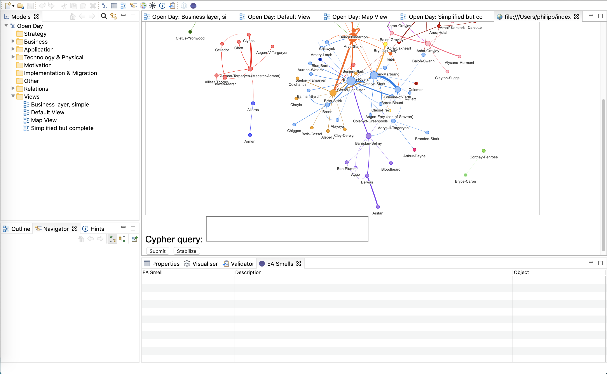
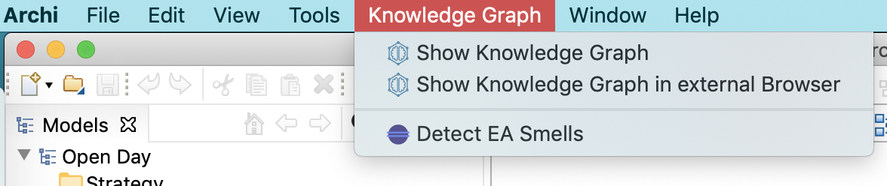
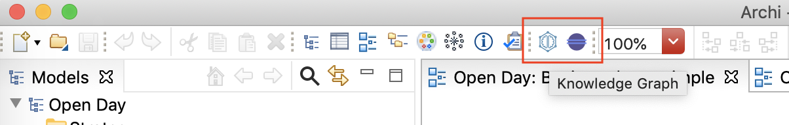

<h1 align="center">Archi KG Analysis Plugin </h1>

  

 

> [Archi](https://www.archimatetool.com/) plugin to visualize and analyze Enterprise Architecture (EA) models as **Knowledge Graphs**, including the detection of **EA Smells**.

## To-Do

## Overview

### Knowledge Graph

Transforms ArchiMate models into a graph structure and adds visualization in form of a *Knowledge Graph*.

The Knowledge Graph View allows for further analysis on the ArchiMate model by offering typical graph algorithms for *Centralities* and *Community Detection*. EA Smell Detection is enabled by executing predefined cypher queries on the graph, while there is also an option to run custom, user-defined queries.

**Technical Details**

Once the `View Knowledge Graph` Action is executed the currently opened model is transformed into a graph structure (GraphML format) by using [CM2KG](https://github.com/borkdominik/CM2KG). If no model is loaded in Archi the Action can not be executed (e.g. menu grayed out).

The transformation is done in the background and the GraphML file is stored in the Archi user directory (`/Library/Application Support/Archi4` on Mac). 

Next Step: Visualize the transformed model as a Knowledge Graph

> TODO ⚠️ 

#### 1st Approach - New graph visualization framework

Use a new tool to directly visualize the GraphML model. 

*Advantages*: 
- Plugin works independently, no graph database required. 
- User does not need to be concerned with setting up an external database and connecting to it.

*Problems*:
- No appropriate tool found yet
- Graph Analysis (Algorithms, EA Smells) might have to be implemented from scratch or could become a tedious/complex task to perfom (e.g. no queries available, no default algorithms like in neovis)
- Knowledge Graph "Visualization" such as in Neovis might not be available (e.g. colors for communities, size of nodes/edges determined by weight/rank)

[List of Graph Visualization Tools](ttps://elise-deux.medium.com/list-of-free-graph-visualization-applications-9c4ff5c1b3cd)  ➜ Mostly tools for specific use-cases (e.g. social media graphs) or unfitting for an Archi Plugin. 

#### 2nd Approach - Keep using neo4j with neovis.js

Transformed model gets stored into a Neo4j database instance, which is either embedded or externally set up by the user. Neovis.js then connects to the instance and visualizes the stored Knowledge Graph. 

*Advantages*: 
- Advanced Graph Analysis becomes easier to perform (cypher queries, neo4j/neovis default features)
- Ready-to-use Visualization and easy to configure

*Problems*:
- External vs Embedded Neo4j instance, not sure if embedded possible

*Embedded Instance*: Creates a new neo4j database instance and stores the transformed model. Neovis then connects to the embedded instance and renders the Knowledge Graph. All of this is done in the background and the user does not have to be concerned with any neo4j setup.  
➜ Still not sure if the embedded neo4j driver can be used within an Archi plugin 

*External Instance*: Requires user to set up an external neo4j database instance (e.g. through Desktop app or sandbox)and provide connections details to the plugin (e.g. in preferences or own view). Neovis then uses this information to connect to the database and render the Knowledge Graph.  
➜ Definitely possible, but well established concept required for appropriate user experience

#### EA Smells

> TODO ⚠️ 

Contains tabular list of detected EA smells. 

#### Graph Analysis

> TODO ⚠️ 

Node size -> Centralities  
Color -> Community Detection  
Relationship Thickness -> Weight

Graph analysis/algorithm functionality offered within the CM2KG platform:

**Centralities**:
- Degree
- Eigenvector
- Page Rank
- Article Rank
- Betweenes
- Approx. Betweenes
- Closeness

**Community Detection**:
- Louvain
- Modularity Optimization
- Label Propagation
- Local Clustering Coefficient

---

### User Interface elements

<!-- TODO: Picture of Archi View (https://github.com/archimatetool/archi-modelrepository-plugin/wiki/Understand-the-Basics) -->

**Menu**

**Toolbar** 

**Views**

- Top-Right: Knowledge Graph View
- Bottom-Right EA Smells View

### Additional Features

Overview of additional features that will be included in the plugin (implementation in later stages).

**Export/Import**

New menu entry in `File -> Export`:
- Model to GraphML
- Model to RDF/OWL

**Preferences**

1. Plugin
   - Current Version
   - "Check for Update" button to update the plugin
2. Neo4j DB Configuration
   - username/password
   - neo4j db link (server:port)
   - database name
3. Smell Detection
   - Detect EA Smells when model gets saved automatically (implicit)
   - Detect EA Smells when executing respective Command (explicit)

## Meeting Notes

Target Audience: EA Architects  
-> Only provide Graph Analysis + EA Smell Detection for now  
-> "Hide" database from user, no custom queries  
 

Include neo4j within client?  
-> Embedded Neo4j, then send data or driver to neovis

---

 

## TODO

- [ ] Use CM2KG to transform model
- [ ] External Neo4J Database
  - [ ] Render with neovis 
- [ ] Embedded Neo4J Database
  - [ ] Render with neovis 
- [ ] Implement Graph Analysis/Algorithms in "Knowledge Graph View"
- [ ] Implement EA Smell Detection

---
 

## Installing the plugin

Detailed instrcutions will follow, for now:

Export the package as a plugin in Eclipse and move the .jar file into the `dropins` folder of Archi. After restarting Archi, the plugin should be active. 

 

## Useful Resources

For useful notes see the `/notes` folder of the repository.

<!-- TODO: Link notes here for quick navigation -->

### Links

[ArchiMate Language Specification](https://pubs.opengroup.org/architecture/archimate31-doc/toc.html)  
[ArchiMate Concepts Overview](https://archimate.visual-paradigm.com/category/archimate-concepts/)  
[Archi User Guide](https://www.archimatetool.com/downloads/Archi%20User%20Guide.pdf)  
[Archi GitHub Repo](https://github.com/archimatetool/archi) ([Wiki](https://github.com/archimatetool/archi/wiki))

**Archi Plugins**

[ArchiContribs](http://archi-contribs.github.io/)  
[Specialization Plugin](https://github.com/archi-contribs/specialization-plugin) - Icons and labels can be replaced in Archi  
[Form Plugin](https://github.com/archi-contribs/form-plugin) - Allows to create forms to view and edit Archi models  
[Repository Plugin](https://github.com/archimatetool/archi-modelrepository-plugin) - Allows collaborative work on Archi (sharing and versioning)

**RCP**  
[RCP Page Eclipse Wiki](http://wiki.eclipse.org/Rich_Client_Platform)

### Publications
[Verification of ArchiMate Behavioral
Elements by Model Checking](https://link.springer.com/content/pdf/10.1007/978-3-319-24369-6_11.pdf) (Plugin for Archi)

 
