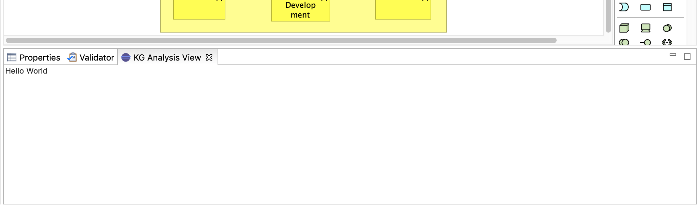

# archi-kganalysis-plugin

>[Archi](https://www.archimatetool.com/) plugin that uses Knowledge Graphs to detect Enterprise Architecture Smells.

## Archi Customizations

### Menubar

### Toolbar

### Import/Export

### Preferences

### Basic View

---
 

## Notes

See the `/notes` folder.

 

## Useful Resources

### Links

[ArchiMate Language Specification](https://pubs.opengroup.org/architecture/archimate31-doc/toc.html)  
[ArchiMate Concepts Overview](https://archimate.visual-paradigm.com/category/archimate-concepts/)  
[Archi User Guide](https://www.archimatetool.com/downloads/Archi%20User%20Guide.pdf)  
[Archi GitHub Repo](https://github.com/archimatetool/archi) ([Wiki](https://github.com/archimatetool/archi/wiki))

**Archi Plugins**

[ArchiContribs](http://archi-contribs.github.io/)  
[Specialization Plugin](https://github.com/archi-contribs/specialization-plugin) - Icons and labels can be replaced in Archi  
[Form Plugin](https://github.com/archi-contribs/form-plugin) - Allows to create forms to view and edit Archi models  
[Repository Plugin](https://github.com/archimatetool/archi-modelrepository-plugin) - Allows collaborative work on Archi (sharing and versioning)

**RCP**  
[RCP Page Eclipse Wiki](http://wiki.eclipse.org/Rich_Client_Platform)

### Publications
[Verification of ArchiMate Behavioral
Elements by Model Checking](https://link.springer.com/content/pdf/10.1007/978-3-319-24369-6_11.pdf) (Plugin for Archi)

 