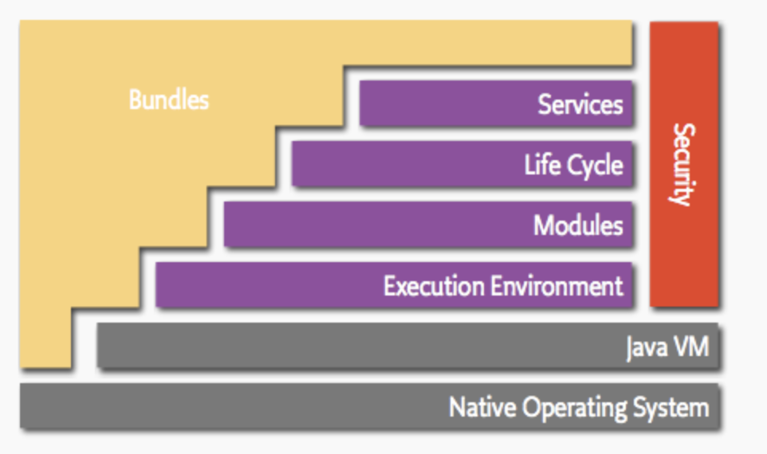

# Development Notes

Helpful Notes for the development process.


## Archi

Main Package: `com.archimate.editor`  
Content:
- 📁 **/diagram**
  - `OverviewOutlinePage` - contains the outline view
- 📁 **/perspectives**
  - `MainPerspective` - sets the initial layout for the views (e.g. leftBottom, right, etc.)
- 📁 **/views**
  - `AbstractModelView` - used for views that show some aspects of the model

Validation Package: `com.archimatetool.hammer`


<br>

## Eclipse RCP

Archi is developed based on the Eclipse Rich Client Platform (RCP).  

### Plug-in manifest
Ties all the code and resources together. Split into 2 manifest files:
- `MANIFEST.MF`, contains OSGi configuration information (API and dependencies)
- `plugin.xml`, contains Eclipse specific extension mechanisms, *Extension-points* (interfaces  for plug-ins  to  contribute  functionality) and *Extensions* (functionality)

### SWT and JFace

**Standard Widget Toolkit (SWT)** - Java based user interface library, provides lots of standard widgets, e.g., buttons and text field or custom widgets  
**JFace** - adds additional convenient functionality on top of SWT and makes the usage of SWT simpler (e.g., JFace builder API)

Key components of SWT:
- `Shell` - represents Window
- `Display` - manages event loops, fonts, colors (base for all SWT components)

[Available SWT widgets](https://www.eclipse.org/swt/widgets/)


<br>

## OSGi

> ➜ [OSGi Architecture](https://www.osgi.org/resources/architecture/)  
> ➜ [OSGi Tutorial](https://www.vogella.com/tutorials/OSGi/article.html)  

Applications are composed of different components and interact with each other via an API. API is the set of classes and methods which can be used by other components. This makes components having a *dependency* on each other (provider/consumer).

OSGi (Open Service Gateway Initiative) is a framework for developing and deploying modular software. The core specification defines a component and service model for Java. The Components communicate through **Services** with each other, while hiding their concrete implementations.

The components are packaged in **Bundles** or **Plugins**. A bundle is a module, which explicitly defines its dependencies to other components and services and has its own life cycle (can be started/stopped/removed). Bundle is a .jar file with a `MANIFEST.MF` containing the dependencies and metadata.

OSGi runtime restricts access to classes from other plugins, to access them their dependencies need to be defined (except Java runtime environment packages). This is enforced with a *classloader*.

### Architecture

OSGi model and different layers:



- *Bundles* - OSGi components made by developers
- *Services* – Connects bundles in a dynamic way by offering a publish-find-bind model
- *Life Cycle* – API to install, start, stop, update, and uninstall bundles
- *Modules* – Defines how a bundle can import and export code
- *Security* – handles security aspects
- *Execution Environment* – Defines what methods and classes are available in a specific platform.

### Equinox

Reference implementation of the core OSGi Specification and the runtime environment for Eclipse Applications.


### Configuration

OSGi meta information stored in `MANIFEST.MF` file.

Example:
```java
Manifest-Version: 1.0
Bundle-ManifestVersion: 2
Bundle-Name: Popup Plug-in
Bundle-SymbolicName: com.example.myosgi; singleton:=true
Bundle-Version: 1.0.0
Bundle-Activator: com.example.myosgi.Activator
Require-Bundle: org.eclipse.ui,
 org.eclipse.core.runtime
Bundle-ActivationPolicy: lazy
Bundle-RequiredExecutionEnvironment: JavaSE-1.6
```

`Bundle-SymbolicName` with `Bundle-Version` uniquely identify a plug-in.

`Bundle-Activator` defines activator class. Once the plugin gets activated an activator instance is created and can be controlled with the `start()` and `stop()` methods. The activator can also be used to configure the plugin during startup (may increase startup time).

`Export-Package` identifier defines the API of a plugin. Other plugins can only access the API when the identifier is set.


### Links

[ArchiMate Language Specification](https://pubs.opengroup.org/architecture/archimate31-doc/toc.html)  
[ArchiMate Concepts Overview](https://archimate.visual-paradigm.com/category/archimate-concepts/)  
[Archi User Guide](https://www.archimatetool.com/downloads/Archi%20User%20Guide.pdf)  
[Archi GitHub Repo](https://github.com/archimatetool/archi) ([Wiki](https://github.com/archimatetool/archi/wiki))

**Archi Plugins**

[ArchiContribs](http://archi-contribs.github.io/)  
[Specialization Plugin](https://github.com/archi-contribs/specialization-plugin) - Icons and labels can be replaced in Archi  
[Form Plugin](https://github.com/archi-contribs/form-plugin) - Allows to create forms to view and edit Archi models  
[Repository Plugin](https://github.com/archimatetool/archi-modelrepository-plugin) - Allows collaborative work on Archi (sharing and versioning)


**RCP**  
[RCP Page Eclipse Wiki](http://wiki.eclipse.org/Rich_Client_Platform)

### Publications
[Verification of ArchiMate Behavioral
Elements by Model Checking](https://link.springer.com/content/pdf/10.1007/978-3-319-24369-6_11.pdf) (Plugin for Archi)