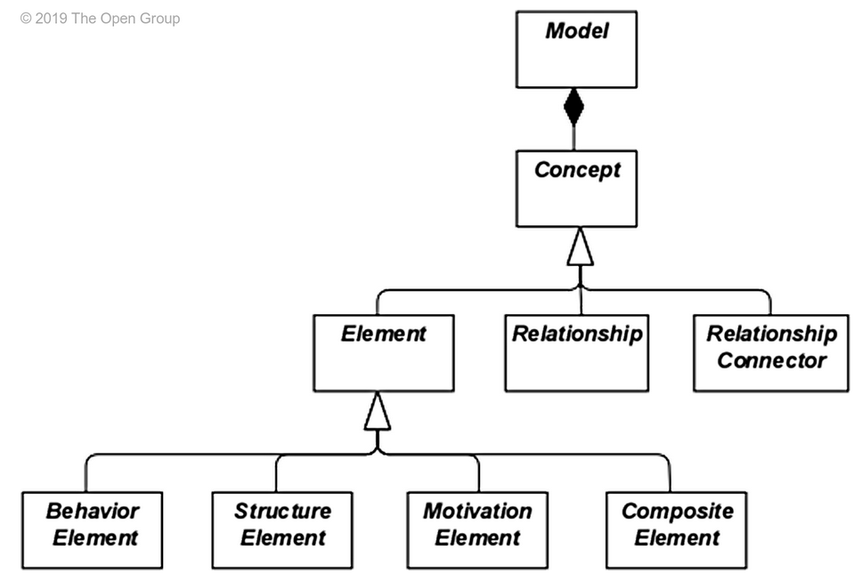
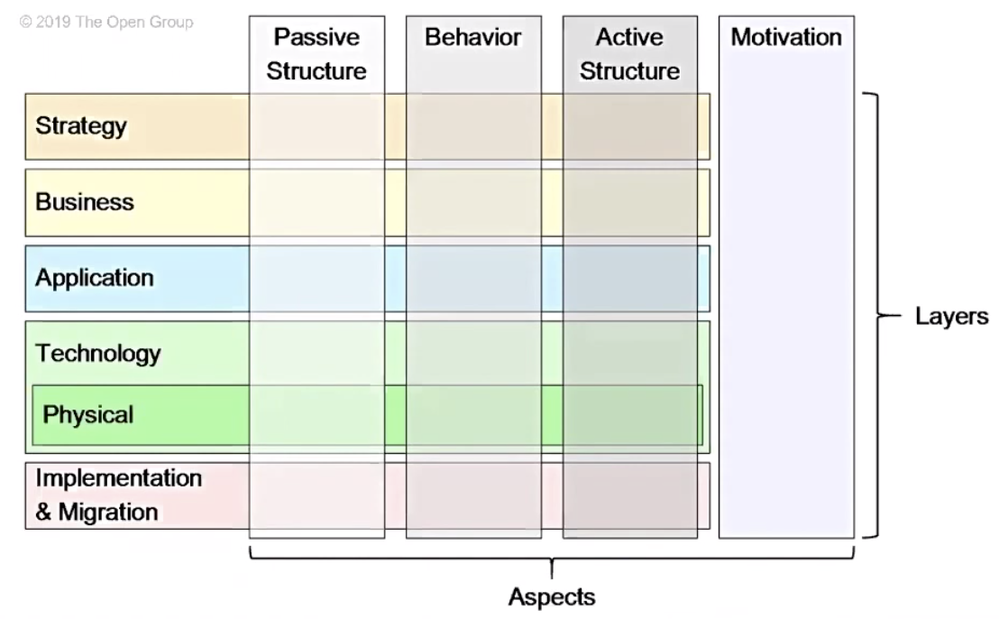
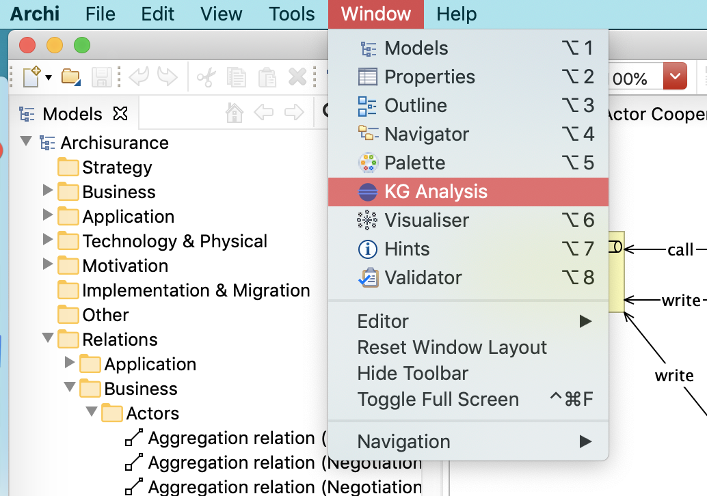
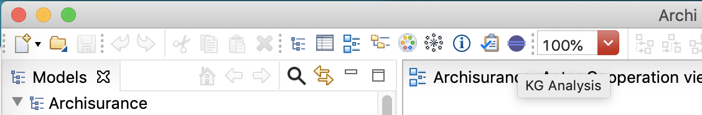
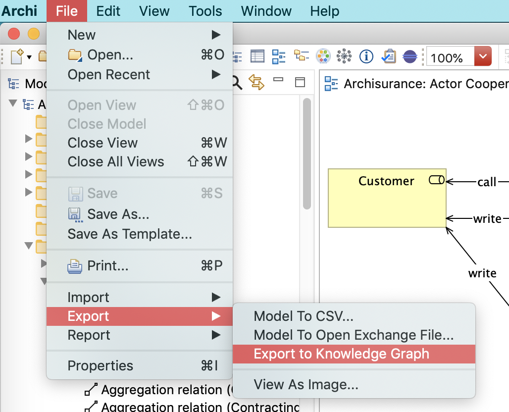

# ArchiMate

**ArchiMate Language** defines the concepts to model Enterprise Architectures.

ArchiMate Language Model (Structure):

**ArchiMate Framework** classifies the elements of the language structure into *layers* and *aspects*.

**Layers**
- *Motivation* - why?
- *Strategy* - how to get there?
- *Business* - structure and function of business organization (conceptual)
- *Application* - running apps, available data (logical)
- *Technology* - (logical & physical)
- *Implementation & Migration*

**Aspects**
- *Passive Structure* - structural elements (business actors, application componets)
- *Behaviour* - behaviour (processes, functions, events) performed by actors
- *Active Structure* - objects on which behavior is performed

ArchiMate Framework:

**Relationships**

[Overview](https://archimate.visual-paradigm.com/archimate-notation-part-8-relationships/)

- *Structural* - e.g. aggregation (element consists of one or more other elements) or realization
- *Dependency* - e.g. serving (element provides functionality to other element)
- *Dynamic* - e.g. flow (transfer from one elemet to another)
- *Other* - e.g. specialization (kind of other element) or association, junction

 

## Archi

Archi uses ArchiMate language

Archi Concepts:

 

## Archi Customizations

### Menubar

### Toolbar

### Import/Export

### Preferences

### Basic View

