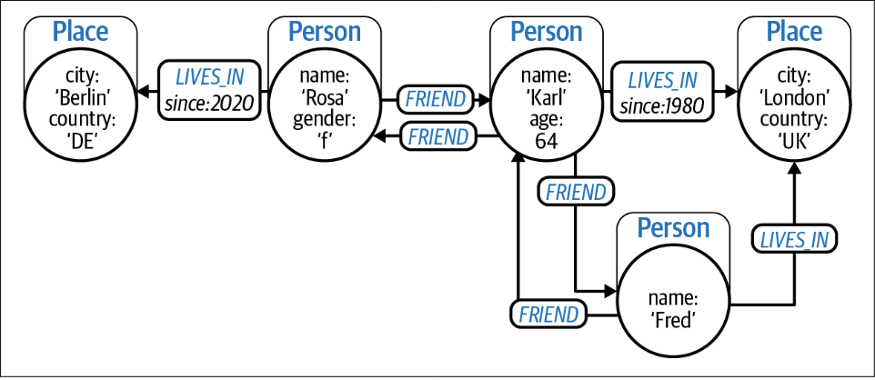

# Knowledge Graphs

## General Graphs

Network of nodes (vertices) connected by relationships (edges) to create a model of a domain. Edges can be directed or undirected.

**Property Graph Model**

Consists of nodes, relationships and properties (key-value pairs).

Nodes:
- Zero or more *Properties* (e.g. price)
- Zero or more *Labels*, which  declare  the  node’s
purpose in the graph (e.g. products)

Relationships:
- *Type* (e.g. bought)
- *Direction*
- Zero or more *Properties* (e.g. distance)
- No dangles (always start and end node)

Example:

## Knowledge Graphs

Knowledge Graphs (KG) are a specific type of graph with an emphasis on contextual understanding. Interlinked set of facts that describe real-world entities, events, or things and  their  interrelations  in  a  human-  and  machine-understandable format.

KGs use an organizing principle to reason about the  data and discovery (additional metadata layer).

