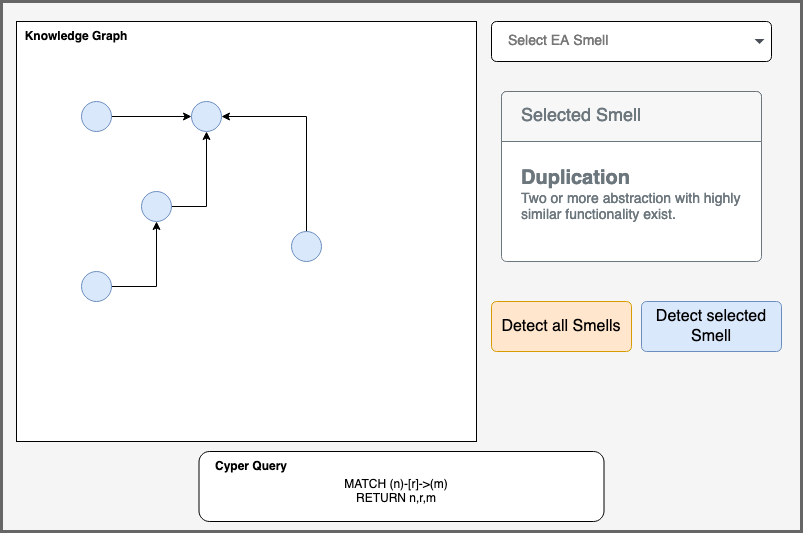

# Meeting Notes

## 19-01-2022

### Current Progress

- [X] **ArchiMate Transformation** 
- [X] **Knowledge Graph UI**
  - [X] configurable Community/Score for Color/Size 
  - [X] Cypher Query
  - [x] EA Smell Detection 

### Next

- Show smells in Table
- Add more smells 
- Refresh/re-import Archi model
- Fix ProgressMonitor


## 14-12-2021

### Conference

Morgen Update

[Link to 1st Conference](https://ea-debts.org/news/first-student-conference-on-ea-debts-related-theses/)

[Link to 2nd Conference](https://ea-debts.org/news/2nd-ea-debts-student-conference/)


**Slides**

Structure

16:9 slides


### Plugin

**Database View** (bottom-left) unneccessary, since it makes the plugin more complex/harder to use

Embedded DB now has a **bolt connector** -> connect to e.g. `bolt://localhost:7687`  


**EA Smells**

[Catalogue/API](https://swc-public.pages.rwth-aachen.de/smells/ea-smells/ ) currently down

Listed some smells with corresponding cypher query in `EA_Smells.md` -> Realize a few of them in application for  the demo


**Transformation**


Steps:
1. Archi Model -> graphML (with CM2KG)
2. Import graphML into neo4j (with apoc.import)
3. Set node/relationship Labels (with apoc.create/apoc.refactor)


*Procedures* can now be easily registered:

```
registerProcedures(graphDb, ExportGraphML.class, GraphRefactoring.class, Create.class);
```

Procedures important for more advanced neo4j functions (import graphml, graph algorithms)


**User Interface**




